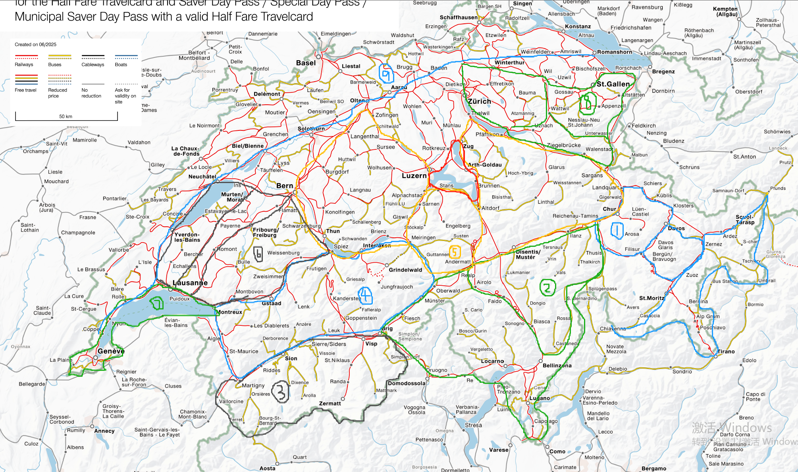

# 分区

在阿尔卑斯山占三分之二国土面积的瑞士，依着山川河流发展的公路和铁路网成了剖析其"技经肯綮"的绝佳工具。为了方便探索和记述，我依照此法(tiān mǎ xíng kōng de xiǎng xiàng)把地图画成几个区域。

<figure>
    
    <figcaption>图片: 分区初稿. 区1: 库尔小猫和凳子. 区2: 提契诺大小牛头. 区3: 瓦莱六叉. 区4: 阿尔卑斯树人面具. 区5: 卢塞恩皇冠米老鼠. 区6: 弗里堡柜子. 区7: 日内瓦海豚. 区8: 圣加仑变形金刚. 区9: 北方市镇.)</figcaption>
</figure>